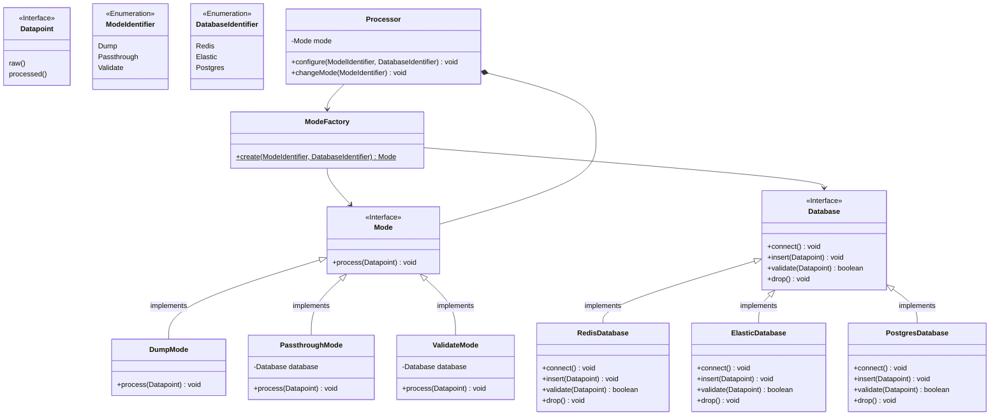

```mermaid
classDiagram
    class Datapoint {
        <<Interface>>
        raw()
        processed()
    }

    class ModeIdentifier {
        <<Enumeration>>
        Dump
        Passthrough
        Validate
    }

    class DatabaseIdentifier {
        <<Enumeration>>
        Redis
        Elastic
        Postgres
    }

    class Database {
        <<Interface>>
        +connect() void
        +insert(Datapoint) void
        +validate(Datapoint) boolean
        +drop() void
    }

    class Processor {
        -Mode mode
        +configure(ModelIdentifier, DatabaseIdentifier) void
        +changeMode(ModeIdentifier) void
    }

    class Mode {
        <<Interface>>
        +process(Datapoint) void
    }

    class DumpMode {
        +process(Datapoint) void
    }
    class PassthroughMode {
        -Database database
        +process(Datapoint) void
    }
    class ValidateMode {
        -Database database
        +process(Datapoint) void
    }

    class ModeFactory {
        +create(ModeIdentifier, DatabaseIdentifier) Mode$
    }

    class RedisDatabase {
        +connect() void
        +insert(Datapoint) void
        +validate(Datapoint) boolean
        +drop() void
    }
    class ElasticDatabase {
        +connect() void
        +insert(Datapoint) void
        +validate(Datapoint) boolean
        +drop() void
    }
    class PostgresDatabase {
        +connect() void
        +insert(Datapoint) void
        +validate(Datapoint) boolean
        +drop() void
    }

    Database <|-- RedisDatabase: implements
    Database <|-- ElasticDatabase : implements
    Database <|-- PostgresDatabase : implements

    Mode <|-- DumpMode : implements
    Mode <|-- PassthroughMode : implements
    Mode <|-- ValidateMode : implements

    ModeFactory --> Database
    ModeFactory --> Mode

    Processor *-- Mode
    Processor --> ModeFactory
```
