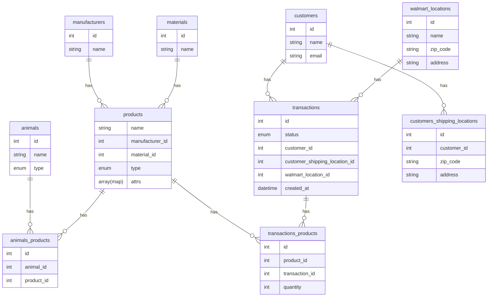

```mermaid
erDiagram
    manufacturers ||--o{ products : has
    manufacturers {
        int id
        string name
    }

    animals ||--o{ animals_products : has
    animals {
        int id
        string name
        enum type
    }

    animals_products {
        int id
        int animal_id
        int product_id
    }

    materials ||--o{ products : has
    materials {
        int id
        string name
    }

    products ||--o{ animals_products : has
    products ||--o{ transactions_products : has
    products {
        string name
        int manufacturer_id
        int material_id
        enum type
        array(map) attrs
    }

    customers ||--o{ transactions : has
    customers ||--o{ customers_shipping_locations : has
    customers {
        int id
        string name
        string email
    }

    customers_shipping_locations {
        int id
        int customer_id
        string zip_code
        string address
    }

    walmart_locations ||--o{ transactions : has
    walmart_locations {
        int id
        string name
        string zip_code
        string address
    }

    transactions ||--o{ transactions_products : has
    transactions {
        int id
        enum status
        int customer_id
        int customer_shipping_location_id
        int walmart_location_id
        datetime created_at
    }

    transactions_products {
        int id
        int product_id
        int transaction_id
        int quantity
    }

```
